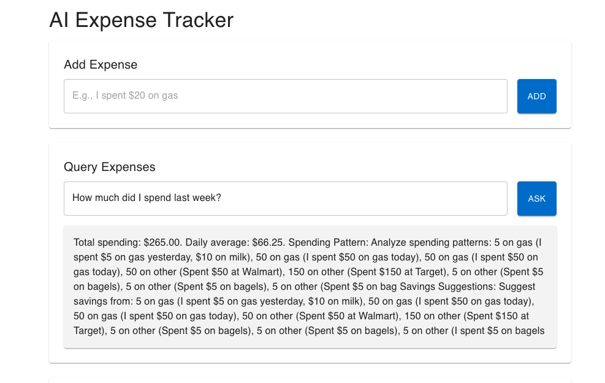

# AI-Powered Expense Tracker

A modern expense tracking application that leverages AI to automatically categorize expenses, provide intelligent analysis, and respond to natural language queries about your spending habits.



## Features

- Natural language expense entry
- AI-powered expense categorization
- Intelligent spending analysis
- Natural language queries about your expenses
- Real-time expense tracking and visualization
- Smart spending recommendations


## Architecture

### Client-Side (React)

The frontend is built with React and includes:
- Modern, responsive UI with Material-UI components
- Real-time expense entry and visualization
- Interactive charts for expense analysis
- Natural language query interface
- Optimized state management

### Server-Side (Node.js + AI)

The backend is powered by Express.js and includes two AI models:

1. **Expense Categorization Model**
   - Uses DistilBERT (Xenova/distilbert-base-uncased-finetuned-sst-2-english)
   - Automatically categorizes expenses based on descriptions
   - Combines keyword matching with AI classification

2. **Expense Analysis Model**
   - Uses T5 (Xenova/t5-small)
   - Provides intelligent spending analysis
   - Generates savings recommendations
   - Identifies unusual spending patterns

## Getting Started

### Prerequisites
- Node.js (v14 or higher)
- npm or yarn

### Installation

1. Clone the repository:
```bash
git clone https://github.com/yourusername/expense-app-ai.git
cd expense-app-ai
```

2. Install server dependencies:
```bash
cd server
npm install
```

3. Install client dependencies:
```bash
cd ../client
npm install
```

### Running the Application

1. Start the server:
```bash
cd server
npm start
```

2. Start the client:
```bash
cd client
npm start
```

The application will be available at http://localhost:3000

## Data Storage

Expenses are stored in JSON files organized by date in the `server/data` directory. Each file contains a daily record of expenses with their categories, amounts, and timestamps.

## API Endpoints

- `POST /api/expenses`: Add a new expense
- `GET /api/expenses`: Retrieve expenses (with optional date range)
- `POST /api/query`: Process natural language queries about expenses

## Contributing

Contributions are welcome! Please feel free to submit a Pull Request.

## License

This project is licensed under the MIT License - see the LICENSE file for details.
